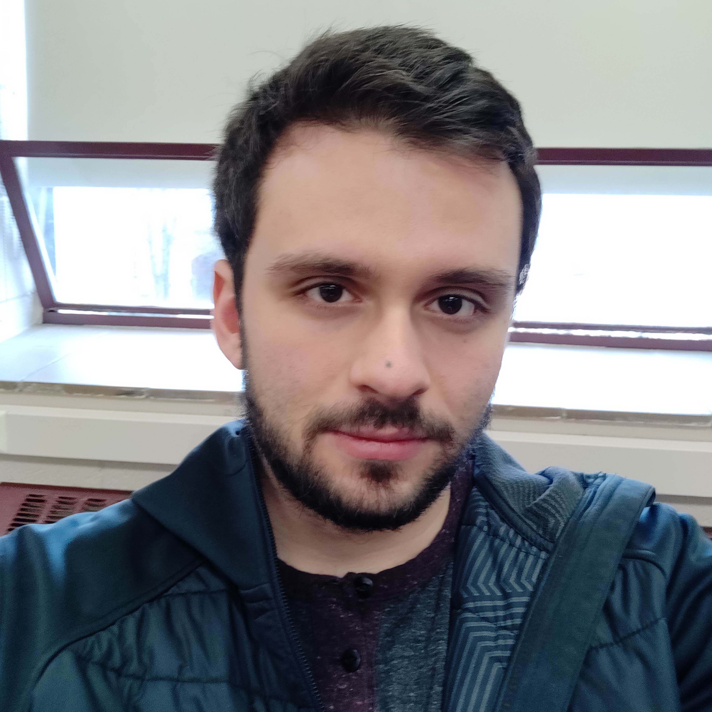

## About Me

I am a Ph.D student at [CS@VT](https://cs.vt.edu/), advised by Dr. [Matthew Hicks](http://www.impedimenttoprogress.com/). I'm generally interested in architecture and embedded systems. My research is focused on hardware and software support for computation on energy harvesting devices: small, low-power systems using energy scavenged from the environment to sense, compute, and transmit data.

## Publications

<b>Forget Failure: Exploiting SRAM Data Remanence for Low-overhead Intermittent Computation</b>
<b>Harrison Williams</b>, Xun Jian, Matthew Hicks. <i>ASPLOS 2020.</i>
[\[PDF\]](https://harriswms.github.io/ForgetFailure.pdf)
[\[Slides\]](https://harriswms.github.io/ForgetFailureSlides.pdf)
[\[Talk\]](https://www.youtube.com/watch?v=2E-y2FTuliU)

## Typography

This is a [link](http://google.com). Something *italics* and something **bold**.

Here is a table

Year | Award | Category
-----|-------|--------
2014 | Emmy  | Won Outstanding Lead Actor in a miniseries or a movie
2015 | BAFTA | Nominated for Best Leading Actor for Sherlock
2014 | Satellite | Won Best Actor miniseries or television film

Here is a horizontal rule

---

Here is a blockquote

> To a great mind, nothing is little

## References

* Foo Bar: Head of Department, Placeholder Names, Lorem
* John Doe: Associate Professor, Department of Computer Science, Ipsum
