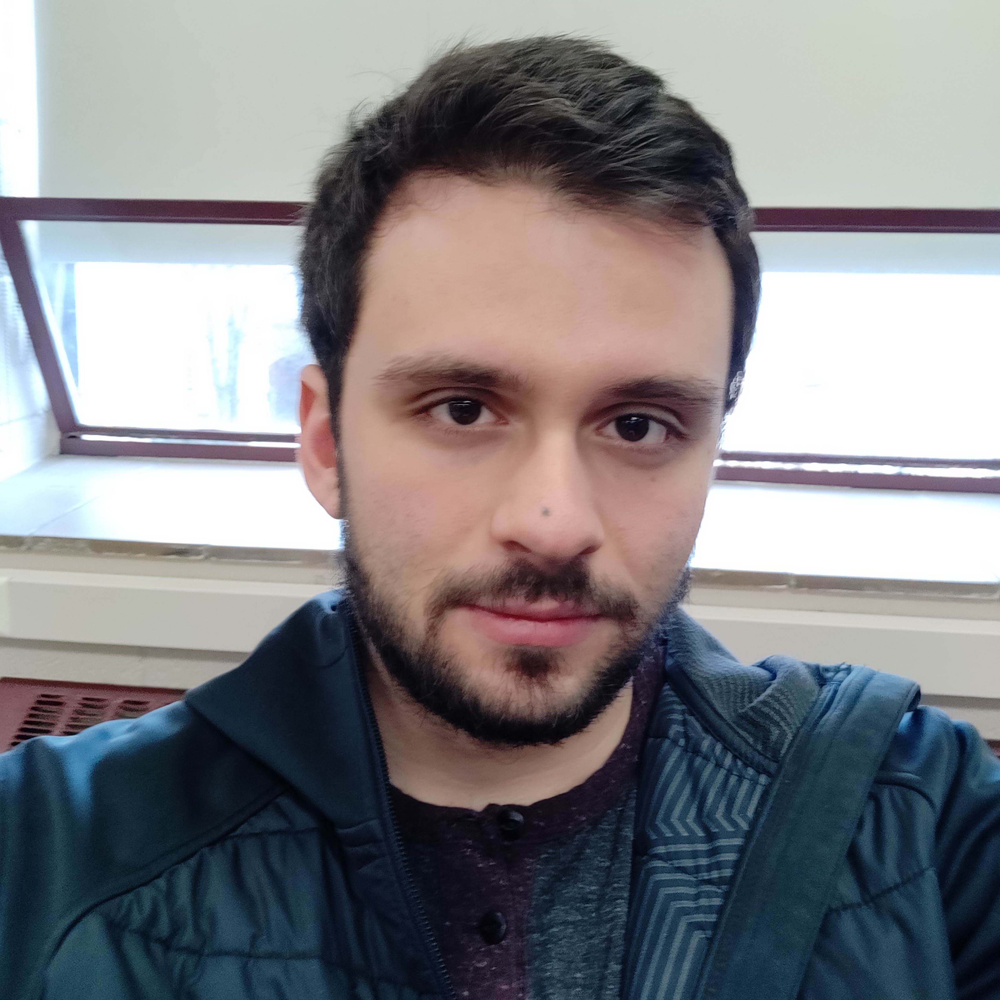

## About Me
---

I am a Ph.D student at [CS@VT](https://cs.vt.edu/), advised by Dr. [Matthew Hicks](http://www.impedimenttoprogress.com/). I'm generally interested in computer architecture, embedded systems, and networking. My research is focused on hardware and software support for computation on energy harvesting devices: small, low-power systems using energy scavenged from the environment to sense, compute, and transmit data.

## Publications
---

<b>Practical Considerations of Energy Harvesting Source in Minimization of Age of Information with Updating Erasures</b>
 
Fariborz Lohrabi Pour, <u>Harrison Williams</u>, Matthew Hicks, Dong Sam Ha. <i>ISCAS 2023.</i>
 

---

<b>Failure Sentinels: Ubiquitous Just-in-time Intermittent Computation via hardware support for continuous, low-cost, fine-grain voltage monitoring</b>
 
<u>Harrison Williams</u>, Michael Moukarzel, Matthew Hicks. <i>ISCA 2021.</i>
 
Low-power, all-digital hardware to monitor energy harvester supply voltage.
[\[PDF\]](https://harriswms.github.io/files/FailureSentinels.pdf)
[\[Slides\]](https://harriswms.github.io/files/FailureSentinelsSlides.pdf)

---

<b>Forget Failure: Exploiting SRAM Data Remanence for Low-overhead Intermittent Computation</b>
 
<u>Harrison Williams</u>, Xun Jian, Matthew Hicks. <i>ASPLOS 2020.</i>
[\[PDF\]](https://harriswms.github.io/files/ForgetFailure.pdf)
[\[Slides\]](https://harriswms.github.io/files/ForgetFailureSlides.pdf)
[\[Talk\]](https://www.youtube.com/watch?v=2E-y2FTuliU)
 
High-performance intermittent computation without high-performance persistent memory using SRAM data retention.

## Teaching
---

#### Principles of Computer Security (CS 4264 @ Virginia Tech)
##### Teaching Assistant - Fall 2019
This course teaches the security mindset and introduces the principles and practices of computer security as applied to software, host systems, and networks. It covers the foundations of building, using, and managing secure systems. Topics include standard cryptographic functions and protocols, threats and defenses for real-world systems, incident response, and computer forensics.

## Recognition
---

Davenport Leadership Scholarship (2022).

NSF Graduate Research Fellowship Program, Honorable Mention (2021).

## Contact
---
hrwill \[at\] vt.edu
